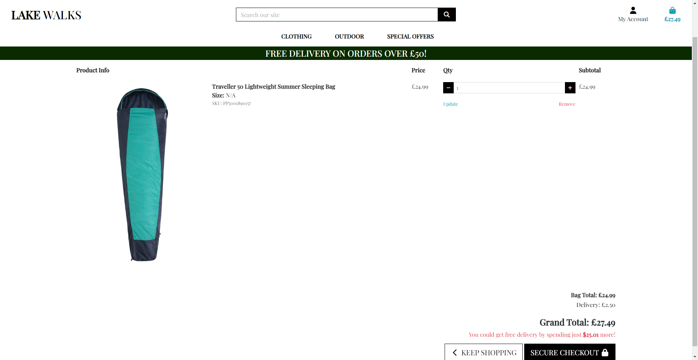

# **Lake Walks**

Lake Walks is an E-commerce shop that specialises in walking, camping and activewear for the outdoors. It is aimed at beginners and people who have a medium to high budget for buying such items. 

Welcome to the journey through [Lake Walks](https://camping-e314fc6eb595.herokuapp.com/).

# Contents

* [**User Experience (UX)**](#user-experience-ux)
    * [User Stories](#user-stories)
    * [Wireframes](#wireframes)
    * [Site Structure](#site-structure)
    * [Design Choices](#design-choices)
    * [Typography](#typography)
    * [Colour Scheme](#colour-scheme)
* [**Features**](#features)
    * [**Home**](#Header)
         * [Header](#Header)
         * [Products](#Products)
         * [Game](#Game)
    * [**Future Features**](#future-features)
* [**Technologies Used**](#technologies-used)
* [**Testing**](#testing)
* [**Deployment**](#deployment)
* [**Credits**](#credits)
    * [**Content**](#content)
    * [**Media**](#media)
* [**Acknowledgements**](#acknowledgements)

# User Experience (UX)

## User Stories

* As a user, I want to be able to navigate through the whole site smoothly.
* As a user, I want to understand the purpose of the site upon loading it.
* As a user, I want to be able to add things to my basket, edit my basket and checkout.
* As a user, I want to be able to sort through the products to find what best suits my needs.
* As a user, I want to be able to see a clear summary of my order history.
* As a user, I want to be able to log in and have my user.

[Back to top](#contents)

## Wireframes

The wireframes for Typer were produced in [Balsamiq](https://balsamiq.com). My wireframes include full-width displays and also small and mobile displays. The final site does start slightly from the wireframes due to differences between the development of the site and my abilities.

[Back to top](#contents)

## Data Structure

## Site Structure

The site consists of a main page, the products page, the detailed products page, the profile, the login page, the register page and a checkout. 

[Back to top](#contents)

## Design Choices

 * ### Typography
      The font chosen was 'Playfair Display', which falls back to cursive and sans-serif respectively. 
     * 'Playfair Display' was chosen for its sense of classic style without looking too old. I thought it would fit the theme of a more classical walking and hiking shop.

 * ### Colour Scheme
      The colour scheme I wanted was a clean yet still classic look of white and black but with dashes of dark green to keep the outdoors feel.

[Back to top](#contents)

# Features

The landing page is very simple with little to show off. It is just a welcome page to give the user a good idea of what kind of shop this is and for what activities.

## Existing Features  
  * ### Header

    * The header of the page is simple and stylish. It has the logo in the top left and then a search bar in the middle. Under are the areas of the shop that you can navigate to and the wider categories. 

[Back to top](#contents)

  * ### Products

      * When you select a category that you wish to look at and browse, you will see a page laid out in four columns of products. Each has a small amount of info about the product and you can click on them to get to the more detailed product area. This is where you can add them to your cart or change the size of an item of clothing.
      * If you are an admin you will also see buttons that let you edit or remove a certain item.

[Back to top](#contents)

  * ### Checkout

    * The site also has a checkout section. in this section you will be able to see the Price, size if you need one and a button to amend or remove the order. At the bottom, you will see a checkout button which you can press and be presented with the checkout form.

[Back to top](#contents)

## Future Features 

* I would like to add shoe sizes to the boots.

* I would like to add a mailing list or subscribe for deals on the site.

* I would like to have more of a social side to the store to share deals.

[Back to top](#contents)

# Technologies Used
* [HTML5](https://html.spec.whatwg.org/) - provides the content and structure for the website.
* [CSS](https://www.w3.org/Style/CSS/Overview.en.html) - provides the styling.
* [Bootstrap](https://getbootstrap.com/) -  provided the scaling and box format.
* [Balsamiq](https://balsamiq.com/wireframes/) - used to create the wireframes.
* [Github](https://github.com/) - used to host and edit the website.
* [Gitpod](https://www.gitpod.io/) - was used when coding.
* [SQLElephant](https://www.elephantsql.com/) - used when hosting.
* [AWS](https://aws.amazon.com/) - used in hosting database.
* [Django](https://www.djangoproject.com/) - Framework

[Back to top](#contents)

# Testing

Please refer to [**_here_**](TESTING.md) for more information on testing Typer.

[Back to top](#contents)

# Deployment

### **To deploy the project**
HEROKU and ELEPHANTSQL
Deploying a Python application on Heroku involves several steps. Here's a general guide: If you don't have a Heroku account, sign up for one at Heroku's website.

Create an account with ElephantSQL
Authorise ElephantSQL with your selected GitHub account
In the Create New Team form:
Add a team name (your name is fine)
Read and agree to the Terms of Service
Select Yes for GDPR
Provide your email address
Click “Create Team”
Your account has been successfully created! Create a database
Click “Create New Instance”
Set up your plan (give a name, select the tiny turtle plan and Irish region)
Select a data centre near you (Ireland)
Then, click Review
Check your details are correct and then click “Create instance”
Return to the ElephantSQL dashboard and click on the database instance name for this project
In the URL section, clicking the copy icon will copy the database URL to your clipboard
Leave this tab open, we will come back here later
Before we can build our application on Heroku, we need to create a few files that Heroku will need to run our application:

A requirements.txt file contains a list of the Python dependencies that our project needs to run successfully.

A Procfile contains the start command to run the project.

Process

Generate the requirements.txt file with the following command in the terminal. After you run this command a new file called requirements.txt should appear in your root directory
pip freeze --local > requirements.txt

Heroku requires a Procfile containing a command to run your program. Inside the root directory of your project create the new file. It must be called Procfile with a capital P, otherwise, Heroku won’t recognise it

Inside the file, add the following command:

web: gunicorn projectname.wsgi:application

In the terminal, install dj_database_url and psycopg2, both of these are needed to connect to your external database.
pip3 install dj_database_url==0.5.0 psycopg2

Update your requirements.txt file with the newly installed packages
pip freeze --local > requirements.txt

In your settings.py file, import dj_database_url underneath the import for os
import os

import dj_database_url

Scroll to the DATABASES section and update it to the following code, so that the original connection to sqlite3 is commented out and we connect to the new ElephantSQL database instead. Paste in your ElephantSQL database URL in the position indicated
DATABASES = {

'default': dj_database_url.parse('your-database-url-here')

}

DO NOT commit this file with your database string in the code, this is temporary so that we can connect to the new database and make migrations. We will remove it in a moment.

In the terminal, run the showmigrations command to confirm you are connected to the external database
python3 manage.py showmigrations

Migrate your database models to your new database
python3 manage.py migrate

Load in the fixtures. Please note the order is very important here. We need to load categories first
python3 manage.py loaddata categories

The products, as the products require a category to be set
python3 manage.py loaddata products

Create a superuser for your new database
python3 manage.py createsuperuser

Finally, to prevent exposing our database when we push to GitHub, we will delete it again from our settings.py - we’ll set it up again using an environment variable in the next video - and reconnect to our local SQLite database.

### **To fork the repository on GitHub**
A copy of the GitHub Repository can be made by forking the GitHub account. This copy can be viewed and changes can be made to the copy without affecting the original repository. Take the following steps to fork the repository;
1. Log in to **GitHub** and locate the [repository](https://github.com/JAEG99/Camping).
2. On the right-hand side of the page in line with the repository name is a button called **'Fork'**, click on the button to create a copy of the original repository in your GitHub Account.

### **To create a local clone of this project**
The method for cloning a project from GitHub is below:

1. Under the repository’s name, click on the **code** tab.
2. In the **Clone with HTTPS** section, click on the clipboard icon to copy the given URL.
3. In your IDE of choice, open **Git Bash**.
4. Change the current working directory to the location where you want the cloned directory to be made.
5. Type **git clone**, and then paste the URL copied from GitHub.
6. Press **enter**, and the local clone will be created.

[Back to top](#contents)

# Credits
### Content

* The font came from [Google Fonts](https://fonts.google.com/).
* The layout is from [Bootstrap](https://getbootstrap.com/).
* The icons came from [Font Awesome](https://fontawesome.com/).
* [Balsamiq](https://balsamiq.com/wireframes/) was used to create the wireframes.
* HTML, CSS, and JavaScript help came from [W3Schools](https://www.w3schools.com/).

### Media
* The photos all came from the developer, [James Gilliland].

[Back to top](#contents)

# Acknowledgments
The site was made a part of Project 4 for [Code Institute](https://codeinstitute.net/). I would like to thank my mentor [Precious Ijege], and my tutor [Komal Karir], and I would like to thank the rest of my peers for helping me fix problems and for helping me with ideas and discussions.

James Gilliland 2024.

[Back to top](#contents)
