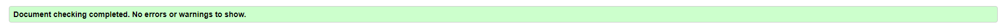
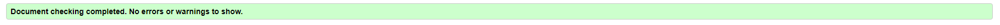
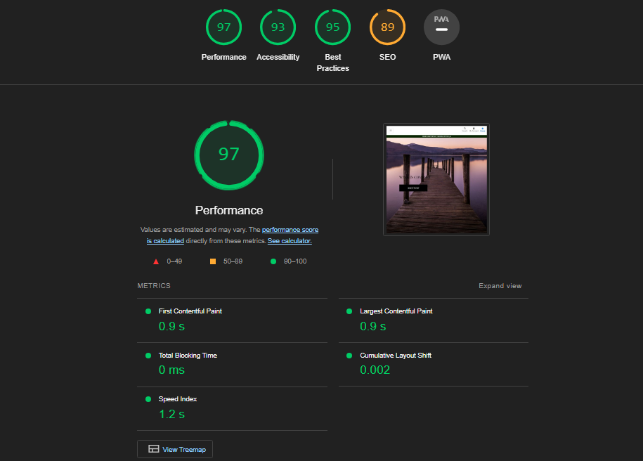

# Testing
## Code Validation
The Typer site has be throughly tested. All the code has been run through the [W3C html Validator](https://validator.w3.org/) and the [W3C CSS Validator](https://jigsaw.w3.org/css-validator/). There was a Button error on the indexc which I ammended, the CSS had two erros which were a very easy fix.

The HTML validator results for each page are below:

* Home page

* Projects page

* Inspiration page

* Contact page

* Form valiadtion page

The CSS validator results are below:

## Responsiveness Test

* The responsive design tests were carried out manually with [Google Chrome DevTools](https://developer.chrome.com/docs/devtools/) and [Responsive Design Checker](https://www.responsivedesignchecker.com/).

|        | Iphone SE | Galaxy S20 Ultra | iPhone 12 pro | iPad | iPad Pro | Display <1200px | Display >1200px |
|--------|---------|-----------|----------|------|----------|-----------------|-----------------|
| Render | pass    | pass      | pass     | pass | pass     | pass            | pass            |
| Images | pass    | pass      | pass     | pass | pass     | pass            | pass            |
| Links  | pass    | pass      | pass     | pass | pass     | pass            | pass            |

## Browser Compatibility

The Lake Walks website underwent testing on various browsers, namely Google Chrome, Microsoft Edge, Safari, and Mozilla Firefox, and no discernible issues were observed from the user's perspective. The website's appearance, functionality, and responsiveness remained consistent across a diverse range of device sizes and browsers.

## Testing User Stories

* As a user, I want to understand the purpose of the site upon loading it.
    * The site has large indications it is a shopping site. It also gives off a more earth and outdoor vibe letting you again know what kind of shop it is. 
     
* As a user, I want to be able to add things to my basket, edit my basket and checkout.
    * On the product info pages you are able to select quantity and on some, the size. Then add it to the bag and this will allow it to be in your bag ready for checkout. When done go to the bag and then complete checkout to get checked out and receive your confirmation email

     
* As a user, I want to be able to sort through the products to find what best suits my needs.
    * YOu can do this with the categories at the top, then the tags and also a sorting selector.

     
* As a user, I want to be able to see a clear summary of my order history.
    * You can do this by looking at your profile which will show your order history.

     
* As a user, I want to be able to log in and have my own user.
    * YOu can do this by registering as a user, confirming your email and then you will have your own user that you can log in and use.

## Known Bugs

    * On mobile devices sometimes the free delivery banner covers some parts even after edits.

* ### Resolved

    * Getting the email set up involved more steps.
        * I had to add the runtime.txt to be able to let Heroku know which version to run which enabled the ability to receive emails set up with the site. 

## Additional Testing
### Lighthouse
The site was also tested using [Google Lighthouse](https://developers.google.com/web/tools/lighthouse) in Chrome Developer Tools to test each of the pages for:
* Performance - How the page performs whilst loading.
* Accessibility - Is the site acccessible for all users and how can it be improved.
* Best Practices - Site conforms to industry best practices.
* SEO - Search engine optimisation. Is the site optimised for search engine result rankings.

The Typer results are shown below

This shows that the site has a high performance. The higesth score being performance and the lowest being SEO.

Back to [README.md](./README.md#testing).